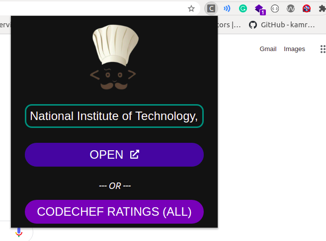

<p align="center">
  <a href="" rel="noopener">
 </a>
</p>

<h3 align="center">Codechef College_Ranklist (Chrome Extension)</h3>


---

<p align="center"> Ever found it time consuming to got to the ranking page of a contest on CodeChef and then type your complete college name to get your college name in the dropdown list and then getting to see the ranklist? Well, no more! Use this extension to remember your college name and it will direct you to your college ranking page in just two clicks (because one  click goes in opening extension 😜️)
    <br> 
</p>

## 📝 Table of Contents

- [About](#about)
- [Getting Started](#getting_started)
- [Usage](#usage)

## 🧐 About <a name = "about"></a>

The Codechef College_Ranklist extension is designed to make it easy for the programmers to get to the ranklist of their college in just one click. The CodeChef design really makes it a time taking process for a programmer to get to his/her college ranklist and compare with his/her college mates. Using this extension, you can easily open the ranklist for your college directly from the Contest's page for that perticular contest, or you can see the overall ranking from anywhere. The ranks get opened in a new seperate tab so that your workflow on current window doesn't gets interrupted.

## 🏁 Getting Started <a name = "getting_started"></a>
 1. To get the extension, download the extension by clicking <a href="extension/unpacked.zip" download>here</a>.
 2. Once downloaded, keep the extension in a safe place where you wont mistakenly delete it.
 3. Open Chrome Browser and type in search bar ```chrome://extensions/```.
 4. Drag and drop the extension you just downloaded in this window.
 5. Your extension shall now be installed (Click on ```Add Extension``` on prompted).

## 🎈 Usage <a name="usage"></a>

- To know the College ranking for a perticular contest on Codechef, head over to the Main Contest page (the page where you get a bunch of questions to choose from and attempt) of that perticular contest.
- Click on the extension.
- If you want to change the name of the college or it's blank, fill in the college name same as it's used by Codechef (A mistake in writing the name may lead to unwilling results).
- If the college name written is indeed the college name you want to get the ranklist for, click on *Open* button.
- If you want to open the overall ranklist of the perticular college, just click on *CODECHEF RATINGS (ALL)* button.
- If college field is left empty, overall ranking would be displayed.